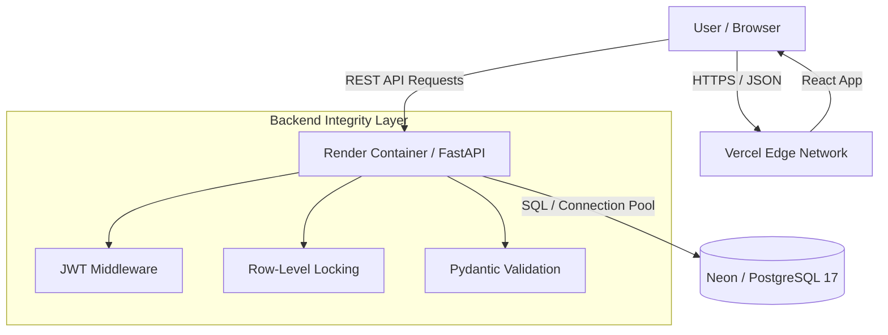

# Banking System Simulation

A production-ready full-stack banking application designed to model **core FinTech engineering principles**.

Unlike standard "CRUD" apps, this project focuses on **Financial Integrity**—ensuring that money is never created, destroyed, or duplicated during concurrent transactions. It implements **ACID compliance**, **Double-Entry Bookkeeping**, and **Row-Level Locking** to handle race conditions in a distributed environment.

---

## 🚀 Live Demo

| Service | URL | Description |
| :--- | :--- | :--- |
| **Frontend** | [banking-system-simulation.vercel.app](https://banking-system-simulation.vercel.app) | React SPA hosted on Vercel Edge Network |
| **API Docs** | [banking-system-simulation.onrender.com/docs](https://banking-system-simulation.onrender.com/docs) | Interactive Swagger UI |
| **Backend** | [banking-system-simulation.onrender.com](https://banking-system-simulation.onrender.com) | FastAPI Container on Render |

> **Note:** The backend is hosted on a free instance and may "sleep" after inactivity. Please allow 30-50 seconds for the first request to wake up the server.

---

## 🛠 Tech Stack & Infrastructure

This project runs on a **Serverless/Containerized** architecture with **$0/month** operating costs.

* **Backend:** Python 3.13, FastAPI, SQLAlchemy 2.0 (ORM), Pydantic (Validation)
* **Database:** PostgreSQL 17 (hosted on **Neon.tech** Serverless)
* **Frontend:** React 18, Vite, TailwindCSS, Zustand (State Management)
* **Authentication:** JWT (Stateless), bcrypt 4.2.1 (Security)
* **Deployment:**
    * **API:** Docker container on **Render.com**
    * **Client:** Static distribution on **Vercel CDN**
    * **CI/CD:** Automated builds via GitHub Webhooks

---

## 🏗 System Architecture

The system implements a strict separation of concerns. The Frontend acts as a presentation layer, while the Backend enforces business rules and the Database guarantees data integrity.

---

## ✨ Key Engineering Concepts

### 1. Atomicity & ACID Transactions
Financial transfers are executed within strict database transaction blocks.
* **Scenario:** User A sends money to User B.
* **Protection:** If the credit to User B fails (e.g., database connection loss) after User A is debited, the system **automatically rolls back** the entire operation. This ensures zero-sum integrity.

### 2. Concurrency Control (Race Condition Prevention)
To prevent "Double Spending" (where a user sends the same funds to two people simultaneously), I implemented **Pessimistic Locking**.
* **Mechanism:** `SELECT ... FOR UPDATE` locks the sender's account row during a transaction.
* **Result:** Concurrent requests are forced to wait until the first transaction commits or fails.

### 3. State Management (Zustand)
I replaced standard `localStorage` reliance with **Zustand** stores to prevent "Stale Data" bugs.
* **Problem:** Switching accounts without a hard refresh often left old user data in the UI.
* **Solution:** A centralized store acts as the "Single Source of Truth," atomically updating both the UI and session storage upon login/logout.

---

## 🐛 Critical Challenges Resolved

During development, I encountered and solved several low-level engineering issues:

* **Python 3.13 Compatibility:**
    * *Issue:* Early builds failed on Render because older `pydantic-core` and `SQLAlchemy` versions were incompatible with Python 3.13's new typing system.
    * *Fix:* Upgraded strict dependency tree to `pydantic 2.10.5` and `SQLAlchemy 2.0.36`.

* **BCrypt Password Truncation:**
    * *Issue:* The `bcrypt` library has a 72-byte limit. Some password inputs caused server 500 errors.
    * *Fix:* Implemented a pre-hashing validation layer and downgraded to `bcrypt 4.2.1` to handle strict truncation safely without crashing the app.

* **CORS in Production:**
    * *Issue:* The frontend (Vercel) could not communicate with the backend (Render) due to strict origin policies.
    * *Fix:* Configured a dynamic whitelist via environment variables (`CORS_ORIGINS`) to strictly allow only the production frontend URL.

---

## 🔌 API Reference

| Method | Endpoint | Access | Description |
| :--- | :--- | :--- | :--- |
| `POST` | `/api/v1/auth/register` | Public | Create new account & auto-generate 10-digit Account ID |
| `POST` | `/api/v1/auth/login` | Public | Authenticate & receive JWT Bearer token |
| `GET` | `/api/v1/accounts/{id}` | Private | Get live balance & account details |
| `POST` | `/api/v1/transactions/transfer` | Private | **Atomic** transfer between two accounts |
| `GET` | `/api/v1/transactions/account/{id}` | Private | Get paginated transaction ledger (Debit/Credit pairs) |

---

## 🔮 Future Roadmap

* [ ] **Email Verification:** Integrate SMTP for user activation.
* [ ] **Multi-Currency:** Add exchange rate logic for USD/EUR/INR transfers.
* [ ] **Audit Logs:** Create a separate microservice for compliance logging.

---

## 👤 Author

**Pragambesh Moro**
* **LinkedIn:** [Connect with me](https://tinyurl.com/43n9ex94)
* **Role:** ECE Student @ Shiv Nadar University | FinTech Enthusiast
